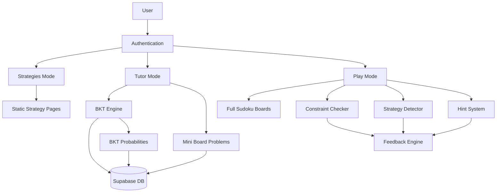

# Sudoku Tutor Implementation Plan

## Overview

Transform my existing Next.js + Supabase starter app into an intelligent Sudoku tutor that teaches explicit logical strategies using Bayesian Knowledge Tracing (BKT), constraint-based modeling, and rule-based strategy detection.

## Architecture Overview



## Database Schema

### 1. Boards Table (`supabase/schemas/boards.sql`)

Store pre-generated boards (full and mini) with metadata.

Declarative schema:

```sql
CREATE TABLE boards (
    id UUID PRIMARY KEY DEFAULT gen_random_uuid(),
    board_type TEXT NOT NULL CHECK (board_type IN ('full', 'mini')),
    difficulty TEXT CHECK (difficulty IN ('easy', 'medium', 'hard')),
    strategy_focus TEXT CHECK (strategy_focus IN ('naked_single', 'hidden_single', 'naked_pair', 'hidden_pair', NULL)),
    initial_state JSONB NOT NULL, -- 9x9 grid: [[0-9, ...], ...] where 0 = empty
    solution JSONB NOT NULL -- Complete solution
);

CREATE INDEX idx_boards_type ON boards(board_type);
CREATE INDEX idx_boards_strategy ON boards(strategy_focus);
CREATE INDEX idx_boards_difficulty ON boards(difficulty);
```

### 2. BKT Probabilities Table (`supabase/schemas/bkt.sql`)

Store mastery probabilities per user per knowledge component.

Declarative schema:

```sql
CREATE TABLE bkt_probabilities (
    id UUID PRIMARY KEY DEFAULT gen_random_uuid(),
    user_id UUID NOT NULL REFERENCES auth.users(id) ON DELETE CASCADE,
    knowledge_component TEXT NOT NULL CHECK (knowledge_component IN ('naked_single', 'hidden_single', 'naked_pair', 'hidden_pair')),
    p_learned DECIMAL(5,4) NOT NULL DEFAULT 0.1, -- p(L0) - initial probability
    p_transit DECIMAL(5,4) NOT NULL DEFAULT 0.3, -- p(T) - probability of learning
    p_guess DECIMAL(5,4) NOT NULL DEFAULT 0.1, -- p(G) - probability of guessing correctly
    p_slip DECIMAL(5,4) NOT NULL DEFAULT 0.05, -- p(S) - probability of slipping
    mastery_probability DECIMAL(5,4) NOT NULL DEFAULT 0.1, -- Current P(L|obs)
    updated_at TIMESTAMPTZ DEFAULT NOW(),
    UNIQUE(user_id, knowledge_component)
);

CREATE INDEX idx_bkt_user ON bkt_probabilities(user_id);
CREATE INDEX idx_bkt_kc ON bkt_probabilities(knowledge_component);
```

## Core Game Logic

### 1. Sudoku Engine (`lib/sudoku/`)

#### `lib/sudoku/types.ts`

- Define `Board` type (9x9 grid: `number[][]`)
- Define `Cell` type with position and value
- Define `Strategy` enum/types

#### `lib/sudoku/constraints.ts`

- `checkRowConstraint(board, row, col, value)`: Check if value violates row constraint
- `checkColumnConstraint(board, row, col, value)`: Check if value violates column constraint
- `checkBoxConstraint(board, row, col, value)`: Check if value violates 3x3 box constraint
- `isValidMove(board, row, col, value)`: Check all constraints
- `getBoxIndex(row, col)`: Get 3x3 box index (0-8)

#### `lib/sudoku/candidates.ts`

- `getCandidates(board, row, col)`: Get possible values for a cell
- `getAllCandidates(board)`: Get candidates for all empty cells

#### `lib/sudoku/strategies.ts`

- `detectNakedSingle(board, row, col)`: Detect if cell has only one candidate
- `detectHiddenSingle(board, row, col, value)`: Detect if value can only go in one cell in unit
- `detectNakedPair(board, unit)`: Detect if two cells share exactly two candidates
- `detectHiddenPair(board, unit)`: Detect if two numbers can only appear in two cells
- `detectStrategyUsed(board, row, col, value)`: Main function to detect which strategy was applied

#### `lib/sudoku/boardGenerator.ts`

- `generateFullBoard(difficulty)`: Generate complete solvable Sudoku board
- `generateMiniBoard(strategy)`: Generate 9x9 board with minimal clues for specific strategy
- `validateBoard(board)`: Ensure board has unique solution
- `removeClues(board, count)`: Remove clues to create puzzle (for difficulty levels)

#### `lib/sudoku/solver.ts`

- `solveBoard(board)`: Backtracking solver (for validation)
- `hasUniqueSolution(board)`: Check if board has exactly one solution

### 2. BKT Implementation (`lib/bkt/`)

#### `lib/bkt/types.ts`

- Define BKT parameters interface
- Define knowledge component types

#### `lib/bkt/engine.ts`

- `updateBKT(priorProb, pTransit, pGuess, pSlip, correct, usedHint)`: Update mastery probability
- `getNextProblem(userId, kc)`: Select next problem based on mastery probabilities
- `shouldShowHint(masteryProb)`: Determine hint level based on mastery

#### `lib/bkt/hooks.ts`

- `useBKT(userId)`: React hook to fetch/update BKT probabilities
- `useUpdateBKT()`: Hook to update BKT after move

#### Event-Based BKT Update Flow

- BKT is updated **event-by-event**, rather than storing full game sessions or move histories.
- When the learner completes a relevant action (for example, applies a strategy correctly in Tutor mode or makes a key move in Play mode), the UI calls a server-side function with:
  - The knowledge component (strategy) being targeted.
  - Whether the response was correct or incorrect.
  - Whether hints were used (and how strong they were).
- The server updates the learner’s `bkt_probabilities` row for that knowledge component and returns the new mastery value (used internally to select future problems and hints).
- Full move histories are not persisted; only the aggregated mastery probabilities are stored to save space and keep the model simple.

### 3. Hint System (`lib/hints/`)

#### `lib/hints/generator.ts`

- `generateHint(board, targetCell, strategy, level)`: Generate hint based on level
  - Level 1: Strategy type hint ("Try using Naked Single")
  - Level 2: Unit hint ("Look at row 3")
  - Level 3: Exact value hint ("Cell (3,5) should be 7")

## API Routes & Server Actions

### `app/api/boards/route.ts`

- `GET /api/boards?type=full&difficulty=easy`: Fetch boards by criteria.
- `GET /api/boards/[id]`: Fetch specific board.

### `app/api/bkt/route.ts`

- `GET /api/bkt`: Get the current user's BKT probabilities for all strategies (used internally).
- `POST /api/bkt/update`: Update BKT after a learner action. Request body includes:
  - `knowledge_component`
  - `correct` (boolean)
  - `used_hint` / hint level information.

### Server Actions (`app/actions/`)

- `submitTutorStep(params)`: For Tutor mode.
  - Validates the learner's response for the targeted strategy.
  - Determines correctness and hint usage.
  - Calls the BKT update function.
  - Returns the next tutor step (info screen, mini board, or strategy-identification task).
- `submitPlayMove(params)`: For Play mode.
  - Validates a move against Sudoku constraints and available strategies.
  - Optionally updates BKT if the move clearly reflects a targeted strategy.
- `updateBKT(userId, kc, correct, usedHint)`: Core helper used by both Tutor and Play flows.

## UI Components

### 1. Shared Components (`components/sudoku/`)

#### `components/sudoku/Board.tsx`

- Render 9x9 grid
- Handle cell input
- Visual feedback (correct/incorrect, hints)
- Highlight units (row/column/box) on hover

#### `components/sudoku/Cell.tsx`

- Individual cell component
- Editable/read-only states
- Visual states (initial clue, user input, correct, incorrect, hint)

#### `components/sudoku/StrategyIndicator.tsx`

- Show detected strategy when user makes move
- Visual feedback for strategy application

#### `components/sudoku/HintButton.tsx`

- Request hint button
- Show hint level indicator

### 2. Strategies Mode (`app/strategies/`)

#### `app/strategies/page.tsx`

- List of all four strategies
- Links to individual strategy pages

#### `app/strategies/[strategy]/page.tsx`

- Static explanation page for each strategy
- Example board visualization
- Step-by-step explanation
- Interactive example (optional)

### 3. Tutor Mode (`app/tutor/`)

#### `app/tutor/page.tsx`

- Main tutor interface
- Show current problem (mini board)
- Progress indicator (mastery probabilities)
- Strategy explanation panel
- Next problem button (adaptive selection)

#### `app/tutor/components/ProblemDisplay.tsx`

- Display current mini board
- Show strategy focus
- Explanation text

#### `app/tutor/components/ProgressPanel.tsx`

- Display BKT mastery probabilities for each KC
- Visual progress bars

### 4. Play Mode (`app/play/`)

#### `app/play/page.tsx`

- Board selection (difficulty)
- Full Sudoku board interface
- Move history
- Hint system
- Strategy detection feedback

#### `app/play/components/GameControls.tsx`

- Difficulty selector
- New game button
- Undo/redo (optional)
- Hint button

#### `app/play/components/FeedbackPanel.tsx`

- Show constraint violations
- Show strategy-specific feedback
- Show detected strategy

## Board Generation Script

### `scripts/generateBoards.ts`

- Generate and store boards in database
- Generate full boards (easy: ~35 clues, medium: ~28 clues, hard: ~22 clues)
- Generate mini boards for each strategy (minimal clues to demonstrate strategy)
- Validate uniqueness before storing
- Run via: `npm run generate-boards` or `tsx scripts/generateBoards.ts`

## Setup and Prerequisites

### Local Development Setup

Before starting implementation, run the setup script from the starter app to initialize local Supabase:

```bash
chmod +x setup.sh   # only needed once
./setup.sh
```

This will:
- Install dependencies (`npm install`)
- Start local Supabase instance (requires Docker)
- Create `.env.local` with Supabase credentials
- Run all migrations including existing starter app migrations

**Note:** The GitHub Actions workflow file is currently renamed to `disabled-migrate.yml` to prevent running migrations against a public Supabase instance during development. When ready to deploy to production/public Supabase, rename it back to `migrate.yml` (see "Deployment" section below).

## Implementation Order

1. **Database Schema** (Migrations)

   - Create boards table (without `created_at` timestamp)
   - Create BKT probabilities table
   - (No separate `game_sessions` table; BKT is updated event-by-event)
   - Add RLS policies

2. **Core Sudoku Logic**

   - Types and constraints
   - Strategy detection algorithms
   - Board generator (basic)
   - Solver/validator

3. **BKT Implementation**

   - BKT engine
   - Database integration
   - React hooks

4. **Board Generation**

   - Script to generate initial boards
   - Store in database

5. **API Routes & Server Actions**

   - Board retrieval
   - Per-event BKT update API
   - Tutor step submission
   - Play move validation (with optional BKT updates)

6. **UI Components**

   - Board component
   - Cell component
   - Basic styling

7. **Strategies Mode**

   - Static pages for each strategy
   - Example visualizations

8. **Tutor Mode**

   - Problem display
   - BKT-driven problem selection
   - Progress tracking

9. **Play Mode**

   - Full board interface
   - Constraint checking
   - Strategy detection feedback
   - Hint system

10. **Polish & Testing**

    - Error handling
    - Loading states
    - Responsive design
    - Edge cases

11. **Deployment to Public Supabase**

    - Set up production Supabase project
    - Configure environment variables in Vercel
    - Rename `.github/workflows/disabled-migrate.yml` back to `.github/workflows/migrate.yml`
    - Configure GitHub Secrets (SUPABASE_ACCESS_TOKEN, SUPABASE_PROJECT_REF, SUPABASE_DB_PASSWORD)
    - Test migration workflow

## Key Files to Create/Modify

### New Files

- `supabase/migrations/[timestamp]_create_boards.sql`
- `supabase/migrations/[timestamp]_create_bkt_probabilities.sql`
- `lib/sudoku/types.ts`
- `lib/sudoku/constraints.ts`
- `lib/sudoku/candidates.ts`
- `lib/sudoku/strategies.ts`
- `lib/sudoku/boardGenerator.ts`
- `lib/sudoku/solver.ts`
- `lib/bkt/types.ts`
- `lib/bkt/engine.ts`
- `lib/bkt/hooks.ts`
- `lib/hints/generator.ts`
- `app/strategies/page.tsx`
- `app/strategies/[strategy]/page.tsx`
- `app/tutor/page.tsx`
- `app/play/page.tsx`
- `components/sudoku/Board.tsx`
- `components/sudoku/Cell.tsx`
- `scripts/generateBoards.ts`

### Modified Files

- `app/page.tsx` - Update home page with navigation to three modes
- `app/layout.tsx` - Update metadata
- `proxy.ts` - Add new routes to public routes if needed
- `package.json` - Add any additional dependencies

## Notes

- BKT probabilities are stored per user per knowledge component, not per move
- Boards are pre-generated and stored, not generated on-the-fly
- Mini boards are full 9x9 grids with minimal clues focused on specific strategies
- Strategy detection runs in real-time as user enters values
- Hint system has three layers: strategy type → unit → exact value
- Tutor mode uses hybrid approach: fixed intro problems, then adaptive selection
- GitHub Actions automatic workflow is disabled during development - remove the current "on" section in migrate.yml with the commented out code when ready to start the workflow again.